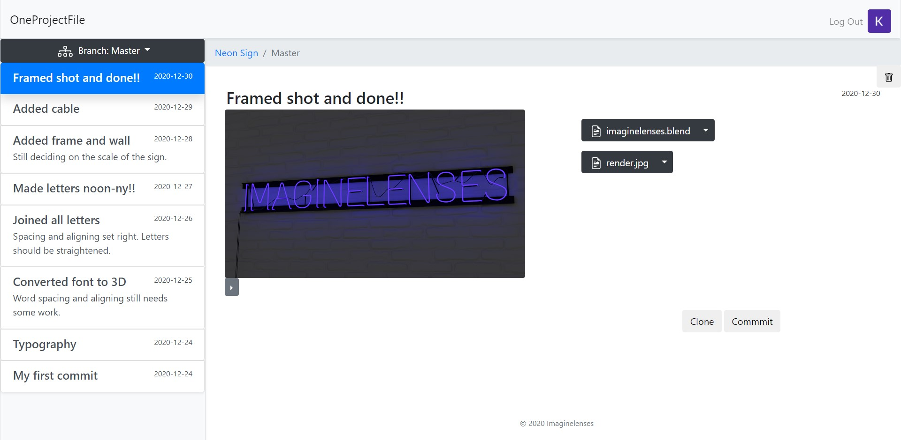
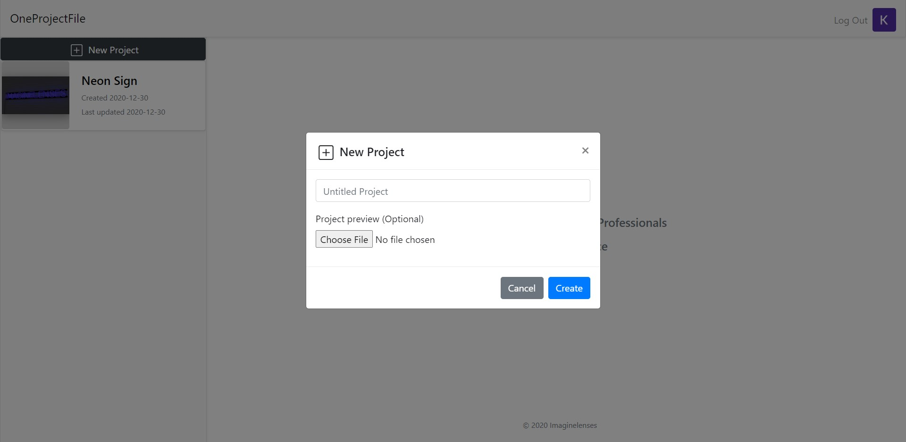
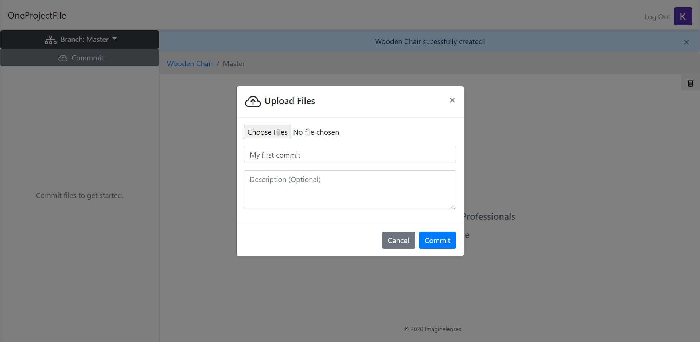
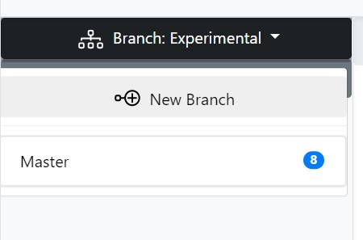
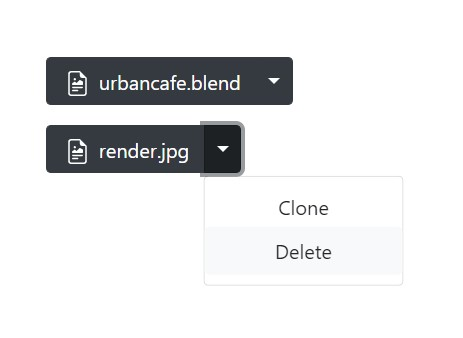
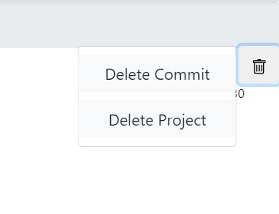
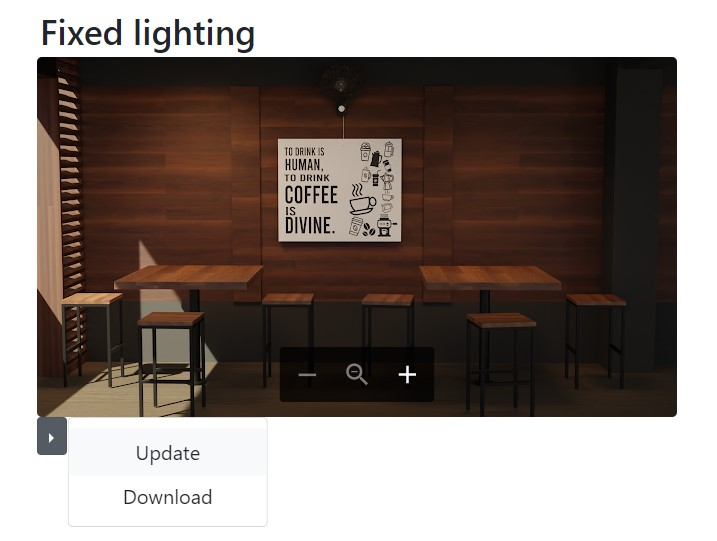

# OneProjectFile
### Version Control for Creative Professionals

A version control software gives you the ability to store all versions of your file in a single place and not worry about filenames and origanisation. Think of it like having just one file stand to store all versions of your file!

Version control has been standard practice in software development to keep track of changes to code for years now. However, when it comes to working with files other than textual files you usually out of luck.

OneProjectFile aims to bring basic version control functionality to a wide range of [filetypes.](https://support.google.com/drive/answer/37603?hl=en) And this is achieved by storing all the files in the user's [Google Drive.](https://www.google.com/intl/en_in/drive/)

## Getting Started
### New Project

To create a new project click the ___New Project___ button on the top left corner.

In the dialogue box that appears:
1. Enter a _Project Name_
2. Optionally chose a _Project Preview_ image file as this can be added or updated later on. (This is only needed as you cannot preview proprietary filetypes.)

### New Commit

#### _Commit_ is function to save the current version of a file or project.

To create your first commit click the ___Commit___ button on the top left corner. (For subsequesnt commits you'll find the commit button on the right bottom corner.)

In the dialogue box that appears:
1. _Choose files_ that you want to commit.
2. Enter a _Commit Message_ - a short message that indicates the changes made.
3. Optionally enter a longer description of the changes made.

### New Branch

#### _Branch_ is a version of your project completely independent from the original.

To create a new branch click the ___Branch: <branch_name>___ dropdown, which lists all the branches, and click the ___New Branch___ button.

### Clone

#### _Clone_ is a function to download the current version of a file or project.

To clone a project click the ___clone___ button on the bottom right corner

To clone just a file click on the file or click the dropdown menu on the right of the file and select the __Clone__ option.

### Delete

To delete a project or just a commit click the trash icon on the top left corner of the page and select the appropriate option in the dropdown menu.

To delete just a file click the dropdown menu on the right of the file and select the __Delete__ option.

### Update and Download Preview

To Update or Download the project preview select the dropdown menu under the preview.

